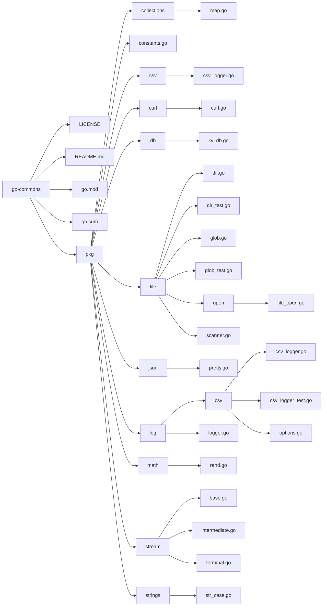

# go-commons

This repository contains a collection of common utility packages written in Go.

## Table of Contents

- [Directory Configuration](#directory-configuration)
- [Packages](#packages)
- [License](#license)

## Directory Configuration

```
go-commons
├── LICENSE
├── README.md
├── go.mod
├── go.sum
└── pkg
    ├── collections
    │   └── map.go
    ├── constants.go
    ├── csv
    │   └── csv_logger.go
    ├── curl
    │   └── curl.go
    ├── db
    │   └── kv_db.go
    ├── file
    │   ├── dir.go
    │   ├── dir_test.go
    │   ├── glob.go
    │   ├── glob_test.go
    │   ├── open
    │   │   └── file_open.go
    │   └── scanner.go
    ├── json
    │   └── pretty.go
    ├── log
    │   ├── csv
    │   │   ├── csv_logger.go
    │   │   ├── csv_logger_test.go
    │   │   └── options.go
    │   └── logger.go
    ├── math
    │   └── rand.go
    ├── stream
    │   ├── base.go
    │   ├── intermediate.go
    │   └── terminal.go
    └── strings
        └── str_case.go
```

## Packages

- **collections**: Provides utility functions for working with collections, such as maps.
- **csv**: Contains CSV related utility functions, including a CSV logger.
- **curl**: Provides a wrapper for making HTTP requests using cURL.
- **db**: Contains utility functions for working with key-value databases.
- **file**: Provides functions for working with files and directories, including glob pattern matching and file scanning.
- **json**: Contains utility functions for pretty printing JSON data.
- **log**: Provides a logging framework, including a CSV logger with configurable options.
- **math**: Contains utility functions for working with math operations, including random number generation.
- **stream**: Provides utility functions for working with stream data, including base, intermediate, and terminal operations.
- **strings**: Contains utility functions for manipulating strings, including case conversion.
- **time**: Contains utility functions for tracking time.

## License

This project is licensed under the [MIT License](LICENSE).

configuration diagram (MERMAID):


